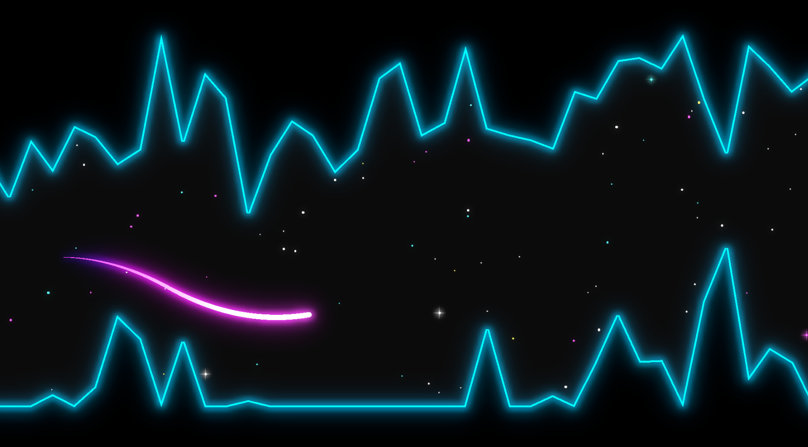

Wavelength
==========

An Neon-themed Endless Wave-runner Made in Godot.

Inspired by games such as *Helicopter Game*.

ToDos
-----

- [ ] Implement Settings Menu
- [ ] Implement Level Seed system
- [X] Implement Highscore Manager and Highscore Menu
- [ ] Show Highscore in Game Over Menu.
- [ ] GameSettings and Autoload (or similar)
- [x] Make sure level fully covers screen at starting position
- [x] In-Game Score display
- [ ] Credits
- [x] Start Paused / Pausing Game
- [ ] Music
